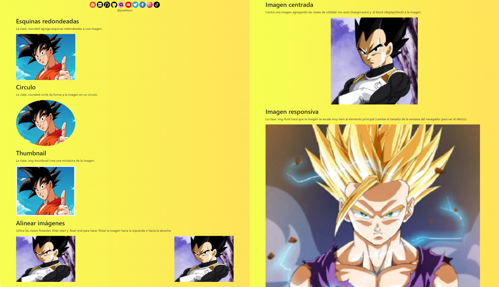

# Bootstrap 5 | Images

📒 Formas de imagen

    📝Esquinas redondeadas, Circulo y Thumbnail.

📒 Esquinas redondeadas

    📝La clase .rounded agrega esquinas redondeadas a una imagen:

        

📒 Circulo

    📝La clase .rounded-circle da forma a la imagen en un círculo:

        

📒 Miniatura

    📝La clase .img-thumbnail da forma a la imagen en una miniatura (con borde):

        

📒 Alineación de imágenes

    📝Haga flotar una imagen a la izquierda con la clase .float-start o a la derecha con .float-end:
        
        
         

📒 Imagen centrada

    📝Centre una imagen agregando las clases de utilidad .mx-auto (margin:auto) y .d-block (display:block) a la imagen:

        

📒 Imágenes responsivas

    📝Las imágenes vienen en todos los tamaños. También las pantallas. Las imágenes responsivas se ajustan automáticamente para adaptarse al tamaño de la pantalla.

    📝Cree imágenes responsivas agregando una clase .img-fluid a la etiqueta . La imagen se escalará muy bien al elemento principal.

    📝La clase .img-fluid aplica max-width: 100%; y altura: automático; a la imagen:

        

Redes sociales:

- https://instagram.com/dev.joseltoro
- https://facebook.com/devjoseltoro
- https://tiktok.com/@dev.joseltoro
- https://dev.to/joseltoro
- https://code.dcoder.tech/profile/joseltoro
- https://joseltoro.blogspot.com/
- https://joseltoro.gumroad.com/